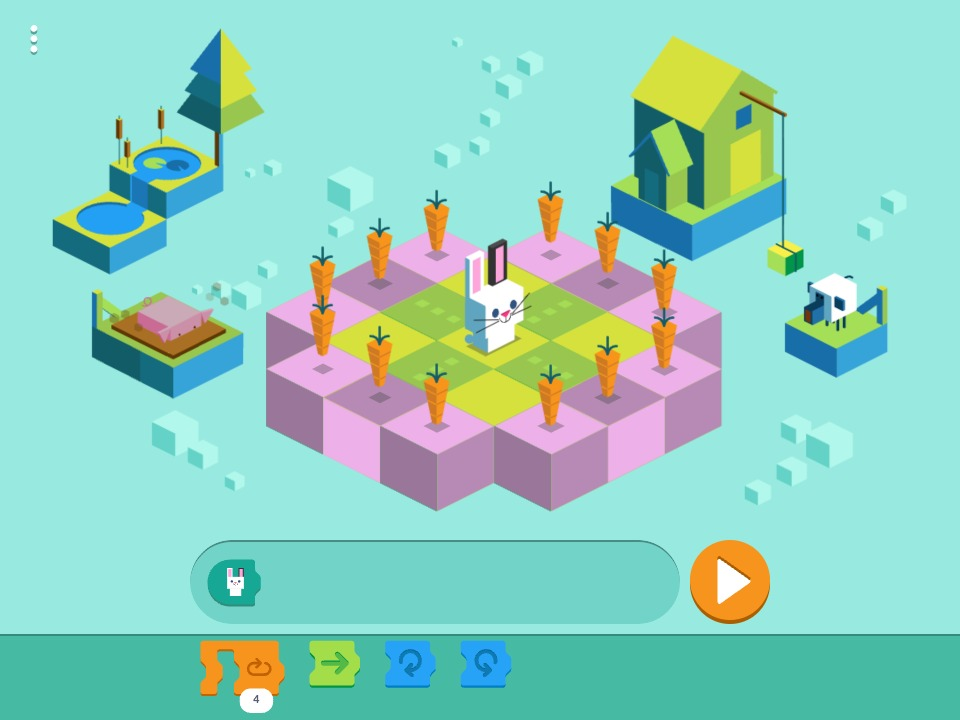
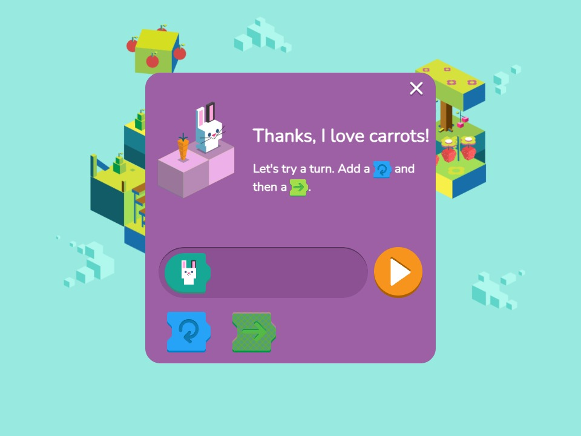
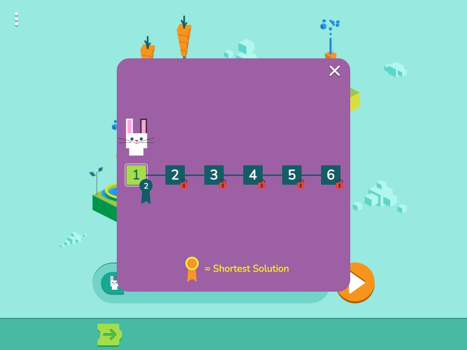

# Rabbit Code

A browser rewrite of the 2017 Google Doodle "Celebrating 50 years of Kids Coding". A rabbit walks
an isometric grid and eats carrots; you program it with Scratch-style blocks - hop forward, turn
left, turn right, repeat. Six levels and three tutorials.

The original is gone from google.com as a playable page. This runs it again, from a rewrite rather
than a copy of the bundle: ~8,000 lines of TypeScript, no runtime dependencies, no game engine.



|                                              |                                             |
| -------------------------------------------- | ------------------------------------------- |
|  |  |

## Roadmap

The goal is a course that teaches a child to program. The game is the part that already works;
these are the two things standing between it and a course.

**A level editor.** Six levels is one sitting. Teaching needs a lot more of them, and hand-editing
map files is not a way to write a curriculum. Most of the pieces are here already - the renderer
can draw a level with no game running, which is what an editor needs - but nothing can write a map
back out yet.

**More blocks.** Move, turn, repeat and the start hat cover sequencing, loops, and working out why
your own program did the wrong thing. That is a genuine first lesson and it is where the block set
stops. Conditionals and variables are the next step, and a conditional needs something to ask
about - the rabbit currently cannot see whether a carrot is ahead of it.

## How it works

The game is two halves that share an event bus.

- **The scene** is Canvas 2D. Sprites are rasterized from SVG sheets at load time and blitted, with
  a hand-written scene graph, tween system and depth sort. No WebGL. The isometric projection is
  `iso(x, y, z) = (x - z, (x + z) / 2 + y)` in world units, one unit per grid cell.
- **The block tray** is [scratch-blocks](https://github.com/scratchfoundation/scratch-blocks) 1.3.0,
  the last release that still ships the horizontal renderer the doodle used. It is loaded as a
  classic script rather than bundled, because its Closure build needs top-level `this` to be
  `window`.

Pressing play walks the block tree into an AST, hands it to a runner that issues one action per
frame, and the renderer draws whatever the puzzle state says.

## Why it's different

Most doodle preservation projects rehost the original bundle. This one does not ship it:

- The artwork, audio, level maps and translations are Google's. `npm run setup` downloads them from
  google.com at build time, so no asset file is committed here. The screenshots above are the one
  exception.
- The same script fetches the original `logo17.html` and `logo17.2.js`, so the untouched original
  is playable next to this one at `/logos/2017/logo17/logo17.html`.
- `scratch-blocks` comes from the npm tarball, hash-pinned, and is unpacked without a tar binary.

Four behaviors the library does not have were rebuilt: the drop shadow under every block,
disabled-block rendering, `.wav`-only sound loading, and the 84 px rounded tray strip.

## Requirements

- Node 20 or newer
- A network connection on the first `npm run dev` or `npm run build` (the asset download)

## Install

```sh
git clone https://github.com/khoanguyen-3fc/rabbit-code.git
cd rabbit-code
npm install
```

## Usage

```sh
npm run dev       # asset download, then a dev server
npm run build     # tsc --noEmit, then a production build into dist/
npm run preview   # serve dist/
npm run format    # prettier
```

`predev` and `prebuild` both run `npm run setup`, which downloads 45 asset files into
`public/logos/` and vendors scratch-blocks into `public/vendor/`. Both are gitignored and both are
skipped if already present.

For a sub-path deployment:

```sh
npm run build -- --base=/rabbit-code/
```

## Localization

`?hl=` picks a language, as the original did - `?hl=vi`, `?hl=ar`, and so on for 88 of them. English
is compiled in; the rest sit in one lazily-imported chunk, so a default load carries none of it.
That is 68 kB gzip saved on every visit that does not ask for a translation.

## Design notes

- **No runtime dependencies.** `npm audit` reports nothing because there is nothing to audit; the
  three devDependencies are Vite, TypeScript and Prettier.
- **UI markup lives in `<template>` elements**, not in `createElement` calls. `index.html` holds
  five of them, cloned by `clone(id)` and read with a throwing `el(root, selector)` so a template
  and the code behind it cannot drift apart silently.
- **The level data is compiled in**, not fetched - `src/data/extracted.ts` holds values taken
  as-is, `src/data/derived.ts` holds everything worked out from them. The split is deliberate: it
  keeps "this is what the data says" separate from "this is what we concluded".
- **Strict TypeScript**, no `any`, no `@ts-ignore`, `noUnusedLocals` and `noUnusedParameters` on.

## Credits and licensing

The code is released under the MIT License. See [LICENSE](LICENSE).

Everything under `src/data/` is not covered by it, and neither are the files `npm run setup`
downloads. Those are level layouts, sprite atlas tables, color palettes, artwork, audio and the
translations for 88 languages, all Google's work and not mine to license. If you fork this, that
restriction travels with you.
